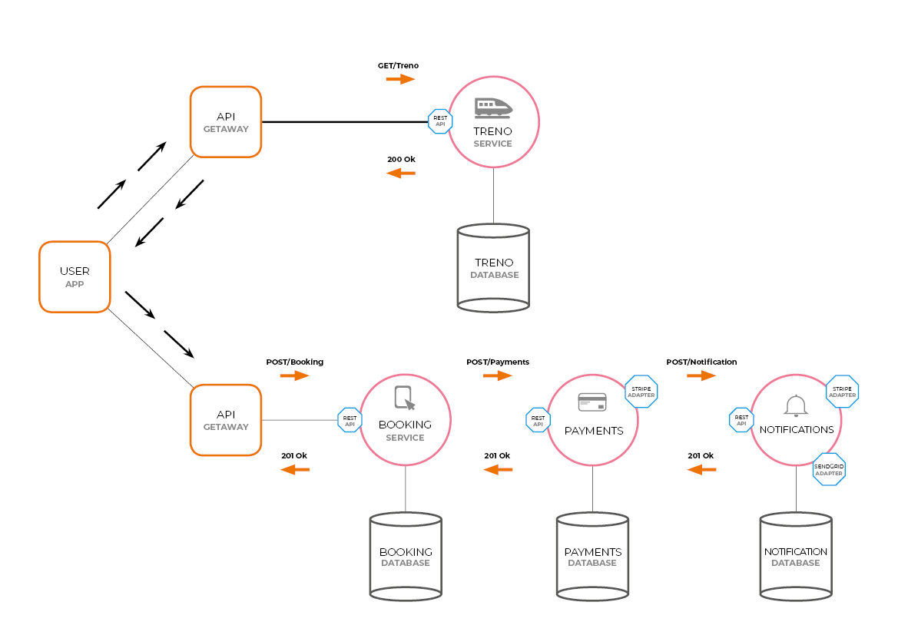

# treni-microservice
A basic Train microservice api with booking service, payment service, and notification service handled by the Api Gateway using Raml, NodeJS, MongoDB, and Docker.

### Design


### Stack
- NodeJS 7.5.0
- MongoDB 3.4.2
- Docker for Mac 1.13.0

### Microservice structure 
1. raml/                # api design
2. repository/ 	        # abstraction over db (where we do our query’s to the database)
    .spec.js            # test
3. server/ 		        # server setup code (instanting new express app, applying middlewares, exporting start function)
4. api/ 		        # creating the routes for our API
5. config/ 		        # configuration file for the app
6. index.js 		    # main entrypoint of the app (putting together everything)
7. package.json         # dependencies
8. integration-test/  

### Microservices
- [Train Service](./treno-service)
- [Booking Service](./booking-service)
- [Payment Service](./payment-service)
- [Notification Service](./notification-service)
- [API Gateway Service](./api-gateway)

### How to run
- need to have docker installed previously

```
$ bash < start.sh
```

This will basically install every microservice and setup the docker swarm cluster
and deploy every docker service in the swarm.

To monitor the cluster in a graphic mode we can go and visit the following url: `http://192.168.99.100:9000`

### LICENSE
The MIT License (MIT)
Copyright (c) 2019 Sara Layachi
